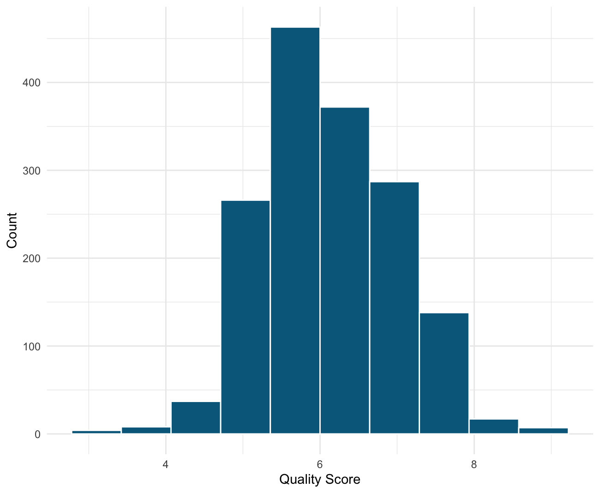
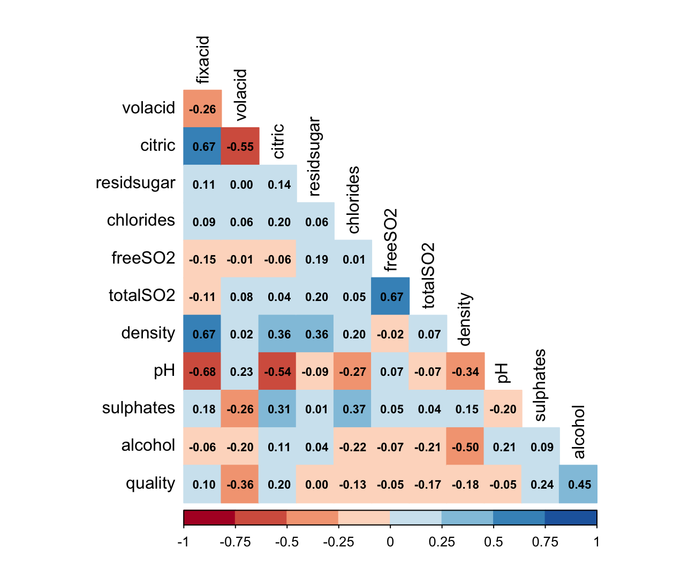
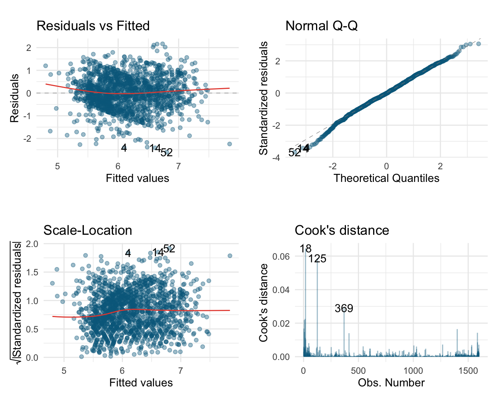
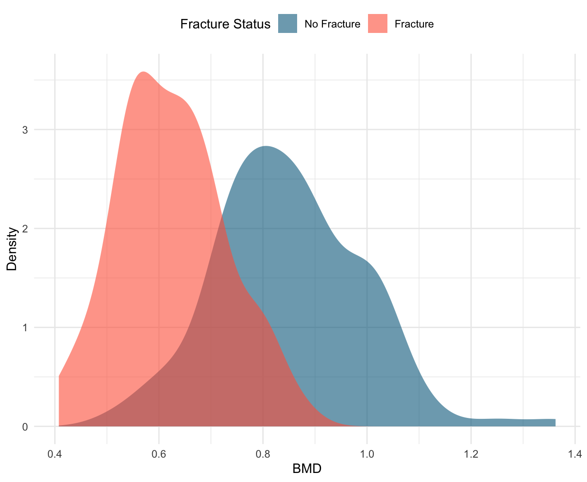
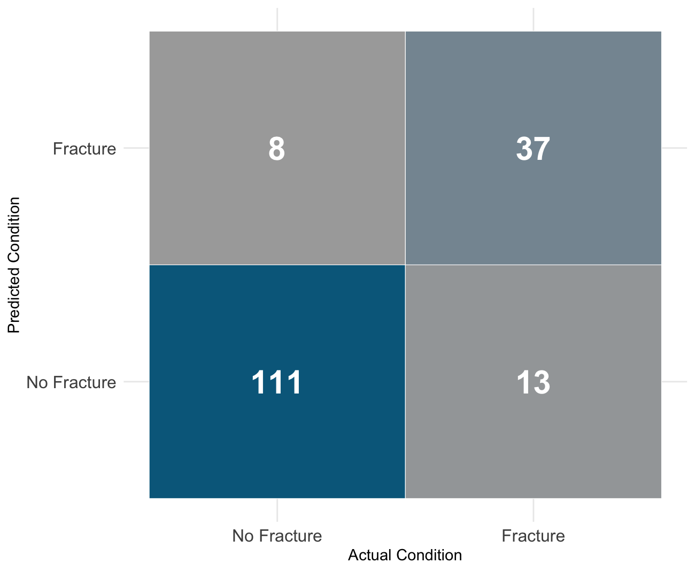

# Statistical Modelling in R: Wine Quality and Hip Fracture Risk

Regression modelling and clinical-risk classification in R, with emphasis on model interpretability, diagnostic checking and honest performance evaluation.

The repository contains two compact modelling case studies:

1. **Wine quality prediction** — multiple linear regression using physicochemical wine measurements.
2. **Hip fracture risk prediction** — logistic regression using bone-mineral-density and clinical variables.

This project demonstrates the full modelling workflow: explore the data, choose an appropriate model, simplify it, check assumptions, evaluate performance and explain the limitations.

## Skills demonstrated

- Exploratory data analysis in R
- Multiple linear regression
- Logistic regression
- Backward stepwise model selection
- Manual model refinement
- Residual diagnostic plots
- Variance Inflation Factor checks
- RMSE evaluation
- Confusion matrix evaluation
- Accuracy, sensitivity and specificity
- Interpretable statistical communication

## Selected outputs

### Wine quality distribution



The distribution plot gives an initial view of the outcome variable before linear regression, including the concentration of wine quality scores around the middle of the scale.

### Wine variable correlation matrix



The correlation matrix was used to identify relationships between physicochemical predictors and to check for possible multicollinearity before modelling.

### Regression diagnostic plots



The diagnostic plots were used to assess linearity, residual behaviour, approximate normality and influential observations in the final wine-quality regression model.

### Bone mineral density by fracture status



The density plot shows the separation between fracture and non-fracture patients by bone mineral density, supporting the choice to include BMD in the logistic regression model.

### Fracture prediction confusion matrix



The logistic regression model was evaluated with a confusion matrix and clinical classification metrics, including sensitivity and specificity rather than accuracy alone.

## Main results

- The wine-quality model was simplified to a smaller set of statistically meaningful predictors, including alcohol, volatile acidity, sulphates, pH, chlorides and total sulphur dioxide.
- The final wine model prioritised parsimony: fewer predictors with almost the same explanatory power as the larger model.
- Bone mineral density was the strongest predictor of hip fracture risk.
- The fracture-risk model was evaluated using sensitivity and specificity because false negatives matter in a clinical-risk context.

## Repository structure

```text
src/statistical_modelling.R   # full R workflow
figures/                      # selected visual outputs used in this README
data/README.md                # expected input files
renv-notes.md                 # package guidance
LIMITATIONS.md                # limitations and possible improvements
```

## Data required

The raw datasets are not committed to this repository. To reproduce the analysis, place the following files in `data/`:

```text
data/redwine.csv
data/bmd-1.csv
```

## How to run

Install the packages listed in `renv-notes.md`, then run the script from the repository root:

```r
source("src/statistical_modelling.R")
```

## What I would improve next

I would turn this into a more production-style project by separating the workflow into reusable functions, saving figures automatically, and adding train/test or cross-validation where appropriate.
